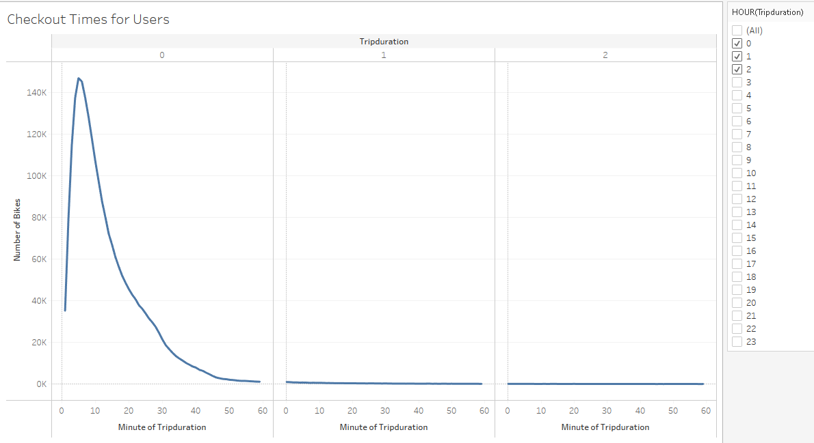
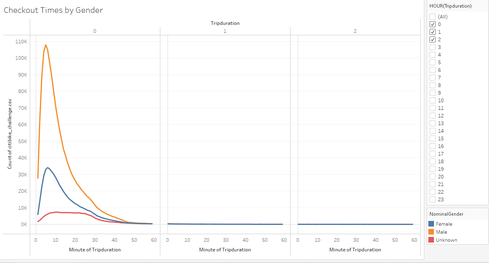
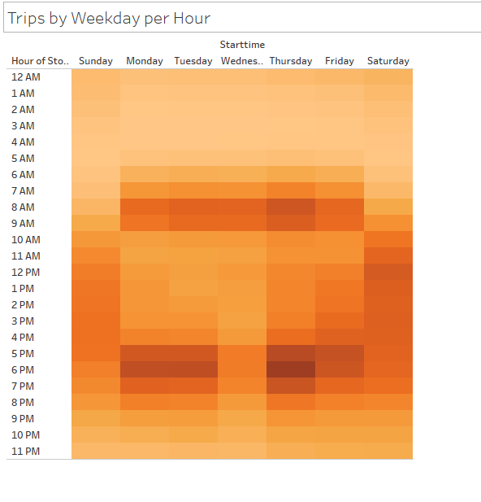
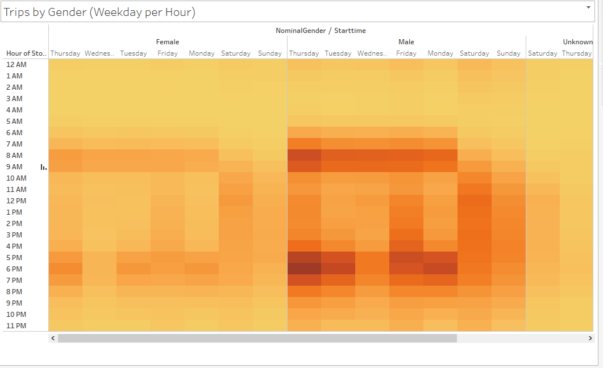
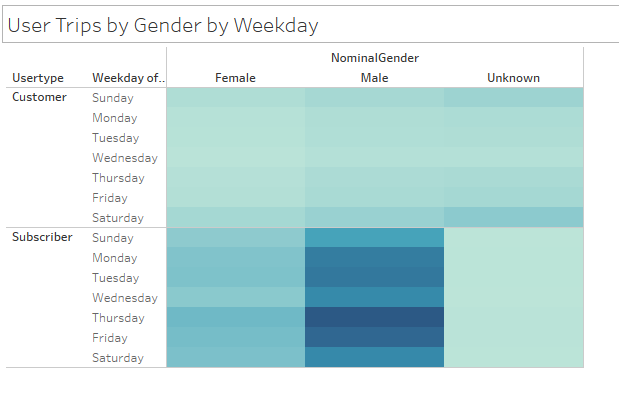

# bikesharing

## I. Overview of Project

### Background
Using bike sharing data from NYC, we need to submit a proposal to an investor how this business would work in Des Moines, Iowa. 

### Objective
To solidify the proposal, we need to show a bike trip analysis with visualizations that:
- Show the length of time that bikes are checked out for all riders and genders
- Show the number of bike trips for all riders and genders for each hour of each day of the week
- Show the number of bike trips for each type of user and gender for each day of the week.

## II. Results

[LINK TO DASHBOARD](https://public.tableau.com/views/NYCCitibikeChallenge_16496411191940/NYCCitibikeChallenge?:language=en-US&:display_count=n&:origin=viz_share_link)

### A. Checkout Times for Users

### B. Checkout Times by Gender

### C. Trips by Weekday per Hour

### D. Trips by Gender (Weekday per Hour)

### E.  User Trips by Gender by Weekday

## III. Summary

### A. Results
- There were a total of 2,344,224 rides in August 2019.
- The average bike ride lasts for 5-6 minutes.
- A great majority of riders were male
- The bikes were used during times for commuting to and from work during weekdays and the whole day for weekends.
- The day with the largest number of users is Thursday.

### B. For Further Analysis
- 
